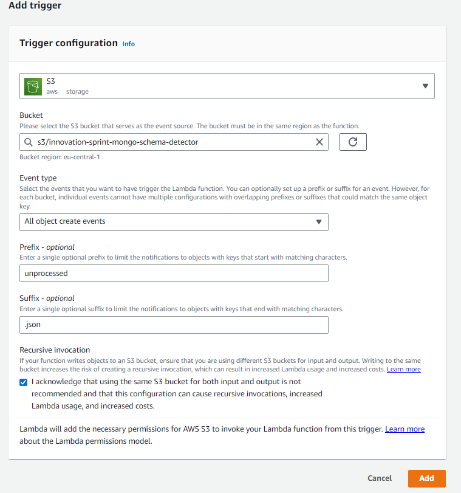

# Sample queries

```json
{
    "ID": "b32a1626-65be-4cc1-81a8-0b6e5cea28d0"
}
```

# Sample payload to trigger lambda from Visual Studio

Make sure that `awsRegion`, `s3.bucket.name`, `s3.object.key`, `s3.bucket.arn` have correct values - do not use values generated by the aws toolkit.

```json
{
  "Records": [
    {
      "eventVersion": "2.0",
      "eventSource": "aws:s3",
      "awsRegion": "eu-central-1",
      "eventTime": "1970-01-01T00:00:00Z",
      "eventName": "ObjectCreated:Put",
      "userIdentity": {
        "principalId": "EXAMPLE"
      },
      "requestParameters": {
        "sourceIPAddress": "127.0.0.1"
      },
      "responseElements": {
        "x-amz-request-id": "EXAMPLE123456789",
        "x-amz-id-2": "EXAMPLE123/5678abcdefghijklambdaisawesome/mnopqrstuvwxyzABCDEFGH"
      },
      "s3": {
        "s3SchemaVersion": "1.0",
        "configurationId": "testConfigRule",
        "bucket": {
          "name": "innovation-sprint-mongo-schema-detector",
          "ownerIdentity": {
            "principalId": "EXAMPLE"
          },
          "arn": "arn:aws:s3:::innovation-sprint-mongo-schema-detector"
        },
        "object": {
          "key": "unprocessed/test3.json",
          "size": 1024,
          "eTag": "0123456789abcdef0123456789abcdef",
          "sequencer": "0A1B2C3D4E5F678901"
        }
      }
    }
  ]
}
```

# Important things to show

* Do not use recursive invocation. Input and output buckets should be different. Writing to the same bucket increases the risk of creating a recursive invocation.



* Handling exceptions - by default it retries two more times, with a one-minute wait between second and third attempt.
  TODO - add links to docs about it. Dead-letter queue.

* Control access to s3 buckets on IAM role level (this would be infrastructure code).

* Share how I will cleanup

* Use tags (owner) to point the owner

* Can read logs from lambda in aws toolkit

* Query in json file is not a json string!

* All examples are in kind of json: https://www.mongodb.com/docs/manual/reference/operator/query/type/

# Links

https://www.mongodb.com/docs/compass/current/schema/
https://www.mongodb.com/docs/manual/reference/operator/query/type/
https://www.mongodb.com/docs/manual/reference/operator/query/exists/
https://www.mongodb.com/docs/manual/reference/command/find/
https://www.mongodb.com/docs/manual/reference/command/count/

https://stackoverflow.com/questions/48649512/mongodb-check-existence-count-vs-findone-performance
https://dba.stackexchange.com/questions/7573/difference-between-mongodbs-find-and-findone-calls
https://www.mongodb.com/docs/manual/reference/method/db.collection.countDocuments/#db.collection.countDocuments


https://www.rahulpnath.com/blog/amazon-s3-lambda-triggers-dotnet/
https://www.youtube.com/watch?v=pqqyDGmaVP8

https://stackoverflow.com/questions/51252665/error-making-request-with-error-code-movedpermanently-and-http-status-code-moved