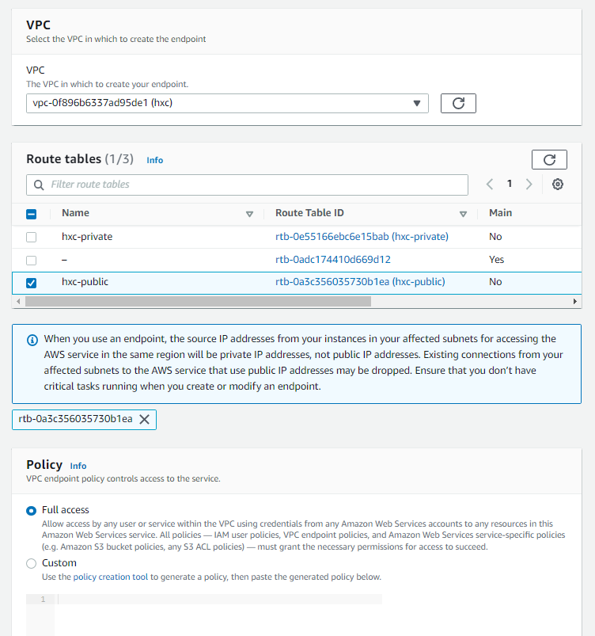

# Sample queries

```json
{
    "ID": "b32a1626-65be-4cc1-81a8-0b6e5cea28d0"
}
```

# Sample payload to trigger lambda from Visual Studio

Make sure that `awsRegion`, `s3.bucket.name`, `s3.object.key`, `s3.bucket.arn` have correct values - do not use values generated by the aws toolkit.

```json
{
  "Records": [
    {
      "eventVersion": "2.0",
      "eventSource": "aws:s3",
      "awsRegion": "us-east-1",
      "eventTime": "1970-01-01T00:00:00Z",
      "eventName": "ObjectCreated:Put",
      "userIdentity": {
        "principalId": "EXAMPLE"
      },
      "requestParameters": {
        "sourceIPAddress": "127.0.0.1"
      },
      "responseElements": {
        "x-amz-request-id": "EXAMPLE123456789",
        "x-amz-id-2": "EXAMPLE123/5678abcdefghijklambdaisawesome/mnopqrstuvwxyzABCDEFGH"
      },
      "s3": {
        "s3SchemaVersion": "1.0",
        "configurationId": "testConfigRule",
        "bucket": {
          "name": "innovation-sprint-mongodb-schema-detector",
          "ownerIdentity": {
            "principalId": "EXAMPLE"
          },
          "arn": "arn:aws:s3:::innovation-sprint-mongodb-schema-detector"
        },
        "object": {
          "key": "input/queries.json",
          "size": 1024,
          "eTag": "0123456789abcdef0123456789abcdef",
          "sequencer": "0A1B2C3D4E5F678901"
        }
      }
    }
  ]
}
```

# Important things to show

* Do not use recursive invocation. Input and output buckets should be different. Writing to the same bucket increases the risk of creating a recursive invocation.


* Handling exceptions - by default it retries two more times, with a one-minute wait between second and third attempt.
  TODO - add links to docs about it. Dead-letter queue.

* Control access to s3 buckets on IAM role level (this would be infrastructure code).

* Share how I will cleanup

* Use tags (owner) to point the owner

* Can read logs from lambda in aws toolkit

* Query in json file is not a json string!

* All examples are in kind of json: https://www.mongodb.com/docs/manual/reference/operator/query/type/

* IAM role used by lambda

* 3 new network interfaces has been created with type lambda

* Create VPC endpoint (only then lambda which is in a VPC can access S3)

* Run command was working locally without problems, problems were in Atlas




# Lambda permissions

The following policies must be assigned to the IAM role `InnovationSprintMongoSchemaDetectorRole` used by the lambda.

* `AmazonVPCCrossAccountNetworkInterfaceOperations` (maybe enough would be inline policy with `ec2:CreateNetworkInterface`).
* `AWSLambdaBasicExecutionRole` - it gives access to the `CloudWatch`.
* Inline policy for accessing selected keys from the `SecretsManager`
  ```json
  {
    "Version": "2012-10-17",
    "Statement": [
        {
            "Sid": "AllowReadStorageSecrets",
            "Effect": "Allow",
            "Action": [
                "secretsmanager:ListSecretVersionIds",
                "secretsmanager:GetSecretValue",
                "secretsmanager:GetResourcePolicy",
                "secretsmanager:DescribeSecret"
            ],
            "Resource": [
                "arn:aws:secretsmanager:us-east-1:[999999999999]:secret:/test_platform/storage/username-[11111]",
                "arn:aws:secretsmanager:us-east-1:[999999999999]:secret:/test_platform/storage/password-[222222]"
            ]
        }
    ]
  }
  ```
* Inline policy for accessing selected `S3` buckets.
  ```json
  {
    "Version": "2012-10-17",
    "Statement": [
        {
            "Sid": "VisualEditor0",
            "Effect": "Allow",
            "Action": [
                "s3:PutObject",
                "s3:GetObject"
            ],
            "Resource": "arn:aws:s3:::innovation-sprint-mongodb-schema-detector/*"
        }
    ]
  }
  ```

# Lambda networking

In case lambda has to connect to a database via its dedicated `VPC endpoint` the lambda has to be added to this `VPC` with additional configuration.

* Create security group `InnovationSprintSecurityGroupMongoSchemaDetector` which accept all traffic (could be more strict to improve security).

* Add lambda to the `VPC` and assign the same subnets (usually it will be **private subnets**) which are attached to the database `VPC endpoint`. Also select created security group `InnovationSprintSecurityGroupMongoSchemaDetector` during assigning lambda to the `VPC`.

* In inbound rules of the security group used in the DB `VPC endpoint` add entry which allows on traffic if the source is `InnovationSprintSecurityGroupMongoSchemaDetector`. Thanks to this lambda will get access to the DB `VPC endpoint`. Another option is to assign another security group to the DB `VPC endpoint` which would allow on such traffic.

* During assigning lambda to the VPC 3 new network interfaces will be created with `interface type` set on `Lambda`. This interfaces are used in communication between lambda and other recourses in the VPC.

**Because our lambda is now in the `VPC` it cannot talk to `S3` and `SecretsManager`. Additional configuration is required.**

* Create VPC endpoint `InnovationSprintMongoSchemaDetectorS3` for accessing S3 by the lambda. Select route table which has routes for the subnets selected in earlier steps (usually it will be **private subnets**).

* Create VPC endpoint `InnovationSprintMongoSchemaDetectorSecrets` for accessing `Secrets Manager` by the lambda. Select the same subnets which are assigned to the lambda and assign security group `InnovationSprintSecurityGroupMongoSchemaDetector` (this security group configuration could be more strict).

Now our lambda should have access to all needed resources: `S3`, `Secrets Manager` and database via 3 different `VPC endpoints`.

>NOTE: **When a lambda is not assign to a VPC then it can talk to other AWS services like `S3` and `SecretsManager` and creating mentioned endpoints is not needed.**

# Terraform

## Backend

```
PS D:\GitHub\kicaj29\MongoDB\MongoDBSchemaDetector\terraform\backend> terraform apply state.tfplan
aws_dynamodb_table.terraform_statelock: Creating...
aws_s3_bucket.bucket: Creating...
aws_dynamodb_table.terraform_statelock: Creation complete after 9s [id=innovation-sprint-terraform-state-table]
aws_s3_bucket.bucket: Still creating... [10s elapsed]
aws_s3_bucket.bucket: Creation complete after 10s [id=innovation-sprint-terraform-state]
aws_s3_bucket_public_access_block.bucket-no-public-access: Creating...
aws_s3_bucket_acl.bucket-acl: Creating...
aws_s3_bucket_versioning.bucket-with-versioning: Creating...
aws_s3_bucket_acl.bucket-acl: Creation complete after 2s [id=innovation-sprint-terraform-state,private]
aws_s3_bucket_public_access_block.bucket-no-public-access: Creation complete after 2s [id=innovation-sprint-terraform-state]
aws_s3_bucket_versioning.bucket-with-versioning: Creation complete after 4s [id=innovation-sprint-terraform-state]
```

## IaC

* Used workspace

```
PS D:\GitHub\kicaj29\MongoDB\MongoDBSchemaDetector\terraform\iac> terraform workspace new demo1-lambda
Created and switched to workspace "demo1-lambda"!

You're now on a new, empty workspace. Workspaces isolate their state,
so if you run "terraform plan" Terraform will not see any existing state
for this configuration.
```

## Destroying selected resources

```
terraform destroy -target="aws_s3_bucket_object.bucket-input"
```

# Cleanup

* Remove 

# Links

https://www.mongodb.com/docs/compass/current/schema/
https://www.mongodb.com/docs/manual/reference/operator/query/type/
https://www.mongodb.com/docs/manual/reference/operator/query/exists/
https://www.mongodb.com/docs/manual/reference/command/find/
https://www.mongodb.com/docs/manual/reference/command/count/

https://stackoverflow.com/questions/48649512/mongodb-check-existence-count-vs-findone-performance
https://dba.stackexchange.com/questions/7573/difference-between-mongodbs-find-and-findone-calls
https://www.mongodb.com/docs/manual/reference/method/db.collection.countDocuments/#db.collection.countDocuments


https://www.rahulpnath.com/blog/amazon-s3-lambda-triggers-dotnet/
https://www.youtube.com/watch?v=pqqyDGmaVP8

https://stackoverflow.com/questions/51252665/error-making-request-with-error-code-movedpermanently-and-http-status-code-moved

Access S3 from lambda within VPC using VPC Endpoint - Lambda with EFS
https://www.youtube.com/watch?v=dbD7_QwQXHo

https://jira.mongodb.org/browse/CSHARP-2668
https://jira.mongodb.org/browse/CSHARP-2271


https://stackoverflow.com/questions/30421379/mongodb-custom-collection-serializer


https://stackoverflow.com/questions/68428733/terraform-getting-error-when-configuring-s3-backend