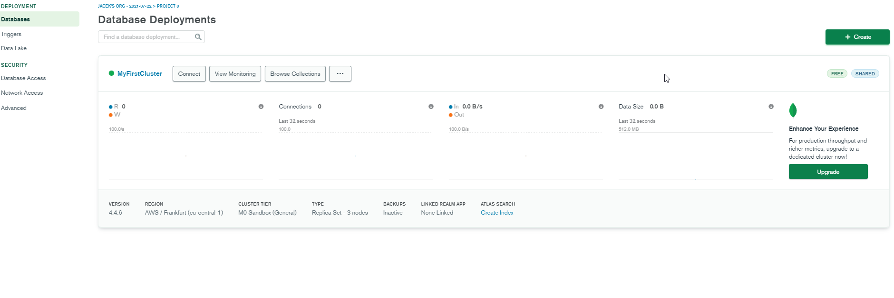
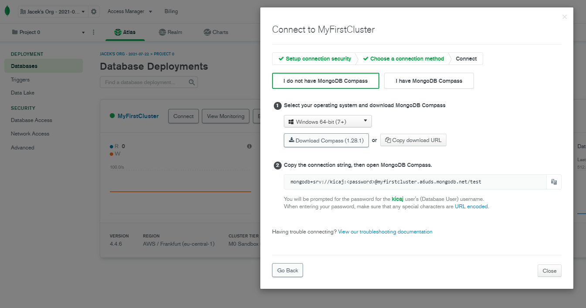

- [Basics](#basics)
  - [MongoDB is document database type.](#mongodb-is-document-database-type)
  - [CAP model for MongoDB](#cap-model-for-mongodb)
  - [SQL Terms vs Mongo DB Terms](#sql-terms-vs-mongo-db-terms)
  - [JSON vs BSON](#json-vs-bson)
- [Setting up MongoDB Atlas](#setting-up-mongodb-atlas)
  - [Create a new project and next go to this project](#create-a-new-project-and-next-go-to-this-project)
  - [Create a free cluster](#create-a-free-cluster)
    - [Load sample data](#load-sample-data)
    - [Monitor create cluster](#monitor-create-cluster)
    - [View sample data](#view-sample-data)
- [CRUD operations](#crud-operations)
  - [Create](#create)

# Basics
## MongoDB is document database type.

Advantages of document database type:
* intuitive data model
* flexible schema
* universal JSON documents
* query data anyway
* distributed scalable database - horizontal scaling

## CAP model for MongoDB

## SQL Terms vs Mongo DB Terms

## JSON vs BSON

# Setting up MongoDB Atlas

Go to https://www.mongodb.com/ and next click "Try Free" and next sign in for example using Google account.

## Create a new project and next go to this project

## Create a free cluster

Select cloud provider and region:

Connection string: `mongodb+srv://kicaj:<password>@myfirstcluster.a6uds.mongodb.net/test`

Download MongoDB Compass and run it (it does not require installation):   

### Load sample data

### Monitor create cluster

### View sample data

In Web Browser:

In MongoDB Compass:

# CRUD operations

* Create: `db.collection.insertOne(), db.collection.insertMany()`
* Read: `db.collection.find()`
* Update: `db.collection.updateOne()`
* Delete: `db.collection.deleteOne()`

## Create

* All write operations in MongoDB are atomic on the level of a single document even if it writes also to multiple embedded sub documents. It means that if we use `db.collection.insertMany()` and single document operation is atomic but the whole operation is not atomic. If we need atomicity for multiple documents that we have to use distributed transactions.

* If the collection does not currently exist insert operations will create the collection (table).

* If an inserted document omits the `_id` field, the MongoDB driver automatically generates and `ObjectId` for the `_id` field.
`_id` field must be unique in the collection otherwise  exception is thrown.